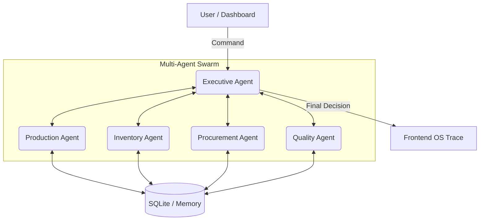

# AgentSwarm AI 🏭🧠

AgentSwarm AI is a multi-agent manufacturing operating system powered by Qwen Cloud. It enables specialized AI agents to collaborate, negotiate, and execute complex business workflows autonomously.

Built for the **Global AI Hackathon Series with Qwen Cloud** under the **Agent Society** track.

## Features

- **Multi-Agent Orchestration:** LangGraph based framework with Executive, Production, Inventory, Procurement, Quality, and Memory agents.
- **Persistent Memory:** Vector-based episodic memory for storing and retrieving past decisions (using pgvector).
- **Autonomous Workflows:** 
  - Production Delay Resolution
  - Inventory Shortage Prediction
  - Supplier Risk Analysis
  - Production Schedule Optimization
- **Dashboard UI:** Next.js 15 app for real-time monitoring and agent collaboration viewing.

## Tech Stack

- **Frontend:** Next.js 15, React, TypeScript, TailwindCSS, shadcn/ui
- **Backend:** FastAPI, Python 3.12, LangGraph
- **Database:** PostgreSQL with pgvector
- **AI/LLM:** Qwen Cloud APIs
- **Deployment:** Docker / Alibaba Cloud ECS

## Local Setup

### Prerequisites
- Docker & Docker Compose
- Node.js 20+
- Python 3.12+

### Quick Start
1. Clone the repository
2. Set your Qwen Cloud API Key in a `.env` file inside `backend/`: `QWEN_API_KEY=your_key`
3. Run `docker-compose up -d --build`
4. Access the Frontend at `http://localhost:3000` and the Backend API at `http://localhost:8000`

## Architecture

### How it Works (Track 3: Agent Society)
When a complex manufacturing issue occurs (e.g., a storm delays microchip shipments), the **Executive Agent** intercepts the problem and triggers the swarm. 
- The **Inventory Agent** analyzes current stock and predicts a shortage.
- The **Procurement Agent** evaluates alternative suppliers for backup components.
- The **Production Agent** adjusts the assembly line schedule to prevent downtime.
All agents communicate via a secure LangGraph state, resolving conflicts autonomously before presenting the final remediation plan to the user.
